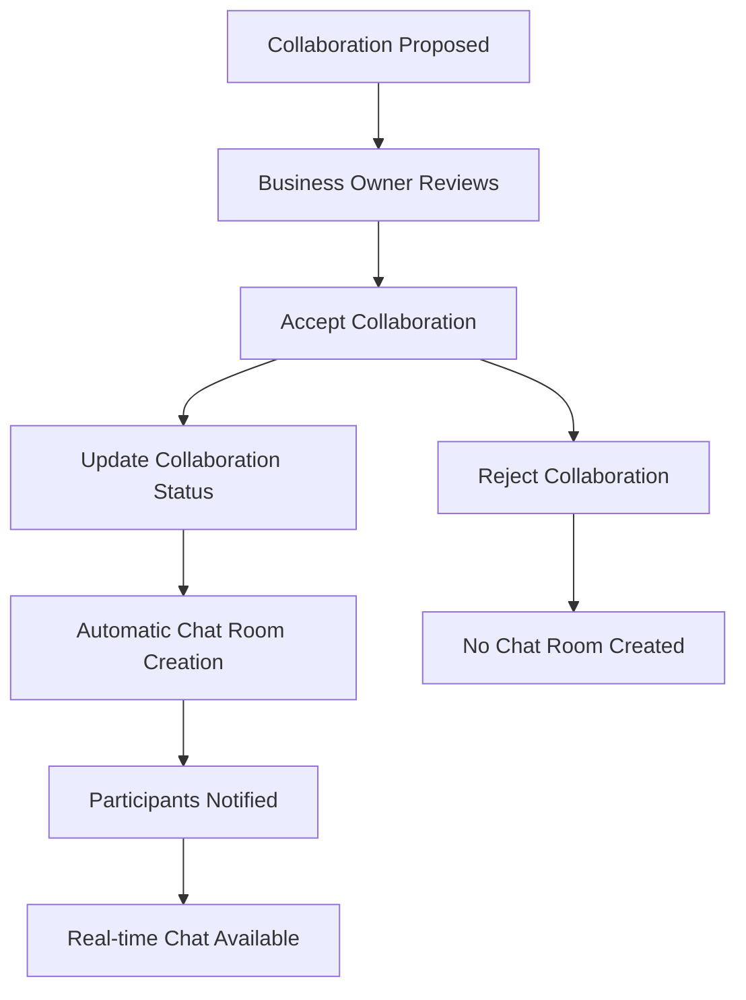

# 💬 Chat Domain Documentation

## Overview

The Chat Domain provides real-time messaging functionality with automatic chat room creation for collaboration partnerships. The system supports both legacy `Collaboration` and enhanced `CollaborationProposal` entities, creating seamless communication channels when business partnerships are established.

## Domain Architecture

### Core Entities

#### ChatRoom Entity
```java
@Entity
@Table(name = "chat_rooms")
public class ChatRoom {
    @Id @UuidGenerator
    private UUID uuid;
    
    @OneToOne
    private CollaborationProposal collaborationProposal;
    
    @OneToOne  
    private Collaboration collaboration;
    
    private String roomName;
    private Boolean isActive;
    
    @CreationTimestamp
    private LocalDateTime createdAt;
}
```

**Key Features:**
- **Dual Entity Support**: References both `CollaborationProposal` and `Collaboration`
- **Automatic Naming**: Room names generated from collaboration titles
- **Participant Identification**: Robust logic to find the "other user" with null-safety fallbacks
- **Status Tracking**: Integration with collaboration status for chat context
- **JSON API Support**: Complete DTO structure for frontend integration

#### ChatMessage Entity
```java
@Entity
@Table(name = "chat_messages")
public class ChatMessage {
    @Id @UuidGenerator
    private UUID uuid;
    
    @ManyToOne
    private ChatRoom chatRoom;
    
    @ManyToOne
    private User sender;
    
    private String message;
    
    @CreationTimestamp
    private LocalDateTime createdAt;
    
    // Read/Unread tracking
    private LocalDateTime readAt;
    private boolean isRead = false;
}
```

**Enhanced Features:**
- **Read Status Tracking**: `readAt` timestamp and `isRead` boolean flag
- **Automatic Read Management**: Messages marked as read when user views chat room
- **Unread Count Queries**: Efficient counting of unread messages per room
- **Real-time Badge Updates**: UI badges update automatically on room selection

### Service Layer

#### ChatService
**Location**: `application/service/ChatService.java`

**Key Methods:**
- `createChatRoomForCollaborationProposal(UUID proposalId)` - Creates chat room for business proposals
- `createChatRoomForCollaboration(UUID collaborationId)` - Creates chat room for product collaborations
- `createChatRoomIfNotExists(UUID id, boolean isProposal)` - Unified creation with duplicate prevention
- `getUnreadCountsByRoomsForUser(List<ChatRoom> chatRooms, User user)` - Bulk unread message counting
- `getUnreadMessageCount(ChatRoom chatRoom, User user)` - Single room unread count
- `markMessagesAsRead(ChatRoom chatRoom, User user)` - Mark messages as read for specific user

**Business Logic:**
- **Duplicate Prevention**: Checks for existing rooms before creation
- **Automatic Naming**: Generates descriptive room names from participant usernames
- **Error Handling**: Graceful failure with detailed logging
- **Transaction Management**: Ensures data consistency

### Repository Pattern

#### Three-Layer Architecture

**Domain Interface** (`ChatRoomRepository`)
```java
public interface ChatRoomRepository {
    ChatRoom save(ChatRoom chatRoom);
    Optional<ChatRoom> findById(UUID uuid);
    Optional<ChatRoom> findByCollaborationProposal(CollaborationProposal proposal);
    Optional<ChatRoom> findByCollaboration(Collaboration collaboration);
    List<ChatRoom> findByParticipant(User user);
    List<ChatRoom> findByIsActiveTrue();
}
```

**Enhanced Message Repository** (`ChatMessageRepository`)
```java
public interface ChatMessageRepository {
    ChatMessage save(ChatMessage message);
    Optional<ChatMessage> findById(UUID uuid);
    List<ChatMessage> findByChatRoomOrderByCreatedAtAsc(ChatRoom chatRoom);
    
    // Unread message management
    long countUnreadMessagesInRoom(ChatRoom chatRoom, User user);
    Map<UUID, Long> getUnreadCountsByRoomsForUser(List<ChatRoom> chatRooms, User user);
    void markMessagesAsRead(ChatRoom chatRoom, User user);
}
```

**JPA Interface** (`ChatRoomJpaRepository`)
- **Split Query Approach**: Separate queries for each collaboration type to avoid complex JPQL
- `findByCollaborationProposalParticipant(User user)` - Finds proposal-based chat rooms
- `findByCollaborationParticipant(User user)` - Finds collaboration-based chat rooms with proper JOINs

**Implementation** (`ChatRoomRepositoryImpl`)
- **Query Combination**: Merges results from both participant query types
- **Clean Separation**: Maintains domain interface abstraction

## Integration Architecture

### Automatic Chat Room Creation

#### Integration Points

**CollaborationController** (`presentation/controller/CollaborationController.java`)
```java
@PostMapping("/{id}/accept")
public String acceptCollaboration(@PathVariable UUID id) {
    // ... validation logic ...
    collaborationService.acceptCollaboration(id);  // Automatic chat creation
    return "redirect:/mypage/received?success=collaboration_accepted";
}
```

**CollaborationProposalController** (`presentation/controller/CollaborationProposalController.java`)
```java
@PostMapping("/{proposalId}/accept")
public ApiResponseData<String> acceptProposal(@PathVariable UUID proposalId) {
    // ... business logic ...
    chatService.createChatRoomForCollaborationProposal(proposalId);  // Automatic chat creation
    return ApiResponseData.success("협업 제안이 수락되었습니다.");
}
```

#### Service Integration

**CollaborationService** (`application/service/CollaborationService.java`)
- **Unified Business Logic**: Handles collaboration acceptance with integrated chat creation
- **Error Resilience**: Chat creation failures don't block collaboration acceptance
- **Comprehensive Logging**: Detailed logging for monitoring and debugging

### Workflow Integration



## User Interface

### Modern Chat Interface

#### Layout Structure
- **Horizontal Flexbox Layout**: Full-screen chat experience
- **Left Sidebar**: Chat room list with search and filtering
- **Right Panel**: Active chat interface with message history
- **Responsive Design**: Mobile-friendly with sidebar collapse

#### Chat Room List Features
- **User Avatars**: Generated from username initials with gradient backgrounds
- **Room Previews**: Last message and timestamp display
- **Unread Message Badges**: Red circular badges (`#dc3545`) with count display
- **Badge Auto-Hide**: Badges automatically hidden when room is selected
- **Search Functionality**: Real-time filtering of chat rooms
- **Status Indicators**: Online/offline status for participants
- **Accessibility**: ARIA labels for screen readers (`aria-label="읽지 않은 메시지 N개"`)

#### Chat Interface Features
- **Message Bubble Alignment**: Right-aligned for own messages (`.bubble.mine`), left-aligned for others (`.bubble.their`)
- **Enhanced Color Scheme**: Dark brown (`#6B3410`) for own messages, light gray (`#f1f1f1`) for received messages
- **Balanced Border Radius**: Proper message tails on appropriate sides (4px radius on tail side, 16px on others)
- **High Contrast Support**: `@media (prefers-contrast: high)` for accessibility
- **Date Separators**: Automatic date grouping for message organization
- **Proposal Cards**: Special message types for collaboration details
- **Real-time Updates**: WebSocket integration for instant messaging
- **Enter-to-Send**: Keyboard shortcuts for improved UX
- **Responsive Design**: Mobile-optimized bubble sizing (85% max-width on mobile)

### WebSocket Integration

#### Connection Management
```javascript
const socket = new SockJS('/ws');
this.stompClient = Stomp.over(socket);

this.stompClient.connect({}, (frame) => {
    this.stompClient.subscribe(`/topic/chat/${roomId}`, (message) => {
        const messageData = JSON.parse(message.body);
        this.appendMessage(messageData);
    });
});
```

#### Message Handling
- **Real-time Delivery**: Instant message appearance without page refresh
- **Connection Recovery**: Automatic reconnection on visibility change
- **Error Handling**: Graceful degradation for connection issues

## API Endpoints

### Chat Management (HTML Views)
- `GET /chat/rooms` - Chat interface with room list
- `GET /chat/room/{roomId}` - Individual chat room view
- `POST /chat/room/create/{proposalId}` - Manual chat room creation

### JSON API Endpoints

#### Chat Room Data
```http
GET /chat/room/{roomId}/data
```
**Functionality:**
- Returns complete chat room data as JSON
- **Auto-marks messages as read** for the requesting user
- Includes participant information and message history

**Response Structure:**
```json
{
  "data": {
    "roomId": "uuid",
    "roomName": "string",
    "collaborationId": "uuid", 
    "otherUser": {
      "userId": "uuid",
      "username": "string"
    },
    "messages": [
      {
        "messageId": "uuid",
        "senderId": "uuid", 
        "senderName": "string",
        "message": "string",
        "createdAt": "2023-08-01T12:00:00"
      }
    ]
  }
}
```

#### Message Sending
```http
POST /chat/message/send
Content-Type: application/json

{
  "roomId": "uuid",
  "message": "string"
}
```

#### User Session Info
```http
GET /api/session/user
```
**Response Structure:**
```json
{
  "data": {
    "uuid": "user-uuid",
    "username": "string",
    "email": "string",
    "role": "string"
  }
}
```

### WebSocket Endpoints
- **Connection**: `/ws` - SockJS endpoint with modern STOMP client
- **Room Subscription**: `/topic/chat/{roomId}` - Room-specific message channel
- **Message Publishing**: `/app/chat/{roomId}` - Send message via WebSocket

### Error Handling
- **Null-Safe Participant Resolution**: Handles cases where `targetBusinessOwner` is null
- **Fallback User Creation**: Creates placeholder user if participant resolution fails completely
- **JSON Content-Type Validation**: Prevents "Unexpected token '<'" errors from HTML responses

## CSS Framework Integration

### Topping Design System
- **Primary Colors**: Brown-based color scheme (`#8B4513`, `#CD853F`)
- **Component Consistency**: Matches existing UI patterns
- **Typography**: Consistent font families and sizing
- **Responsive Breakpoints**: Mobile-first responsive design
- **Animation**: Smooth transitions and hover effects

### Key CSS Classes

#### Layout Classes
- `.chat-container` - Main chat layout container
- `.chat-sidebar` - Left sidebar with room list
- `.chat-main` - Right panel with chat interface

#### Message Styling
- `.bubble.mine` - Own messages (right-aligned, dark brown `#6B3410`)
- `.bubble.their` - Received messages (left-aligned, light gray `#f1f1f1`)
- `.message-time` - Timestamp styling with appropriate contrast
- `.date-separator` - Date grouping separators

#### UI Components
- `.unread-badge` - Red circular badge (`#dc3545`) with count
- `.unread-badge.hidden` - Hidden state for badges with no unread messages
- `.chat-room-item` - Individual room list items
- `.chat-room-item.active` - Selected room styling
- `.proposal-card` - Special collaboration proposal messages

#### Responsive Classes
- Mobile breakpoint at `768px` with adjusted bubble sizing
- High contrast media query support for accessibility

## Performance Considerations

### Database Optimization
- **Query Splitting**: Separate queries for different collaboration types
- **Index Strategy**: Proper indexing on participant lookup fields
- **Connection Pooling**: Efficient database connection management

### Frontend Optimization
- **Lazy Loading**: Chat messages loaded on demand
- **Virtual Scrolling**: Efficient handling of large message histories
- **Debounced Search**: Optimized search performance
- **WebSocket Management**: Proper connection lifecycle management

## Security Considerations

### Authentication & Authorization
- **Session-based Auth**: Integration with existing Spring Security session management
- **Participant Validation**: Ensuring only collaboration participants can access chat rooms
- **CSRF Protection**: Consistent with application security policies

### Data Protection
- **Message Persistence**: Secure storage of chat messages
- **User Privacy**: Access control based on collaboration participation
- **WebSocket Security**: Authenticated WebSocket connections

## Monitoring & Logging

### Application Monitoring
- **Chat Room Creation**: Detailed logging of automatic room creation
- **WebSocket Connections**: Connection establishment and failure tracking
- **Message Delivery**: Real-time message flow monitoring

### Error Handling
- **Graceful Degradation**: Chat creation failures don't block collaboration acceptance
- **User Feedback**: Clear error messages for connection issues
- **Retry Mechanisms**: Automatic reconnection for WebSocket failures

## Future Enhancements

### Planned Features
- **File Sharing**: Document and image sharing in chat rooms
- **Message History**: Pagination and search within chat history
- **Notification Integration**: Push notifications for new messages
- **Mobile App Support**: Native mobile chat integration
- **Message Status**: Read receipts and delivery confirmations

### Scalability Considerations
- **Message Archiving**: Long-term message storage strategy
- **Load Balancing**: WebSocket connection distribution
- **Caching Strategy**: Message and room data caching
- **Real-time Scaling**: Support for high-volume messaging

## Common Issues & Solutions

### Chat Room Creation
**Issue**: Chat rooms not created automatically
**Solution**: Check collaboration acceptance flow and service integration

### WebSocket Connections
**Issue**: Messages not appearing in real-time
**Solution**: Verify WebSocket endpoint configuration and client connection

### UI Responsiveness
**Issue**: Chat interface not responsive on mobile
**Solution**: Check CSS media queries and flexbox layout

### Performance Issues
**Issue**: Slow chat room loading
**Solution**: Optimize participant lookup queries and add proper indexing

## Related Documentation
- [Collaboration Domain](../collaboration/README.md) - Business collaboration system
- [User Domain](../user/README.md) - User management and authentication
- [Notification Domain](../notification/README.md) - Event-driven notifications
- [Frontend Optimization](../../technical/frontend-optimization.md) - Performance improvements
- [WebSocket Configuration](../../technical/websocket-config.md) - Real-time communication setup