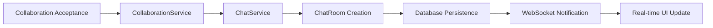

# 💬 Chat System Integration - Technical Documentation

## Overview

This document provides comprehensive technical details for the Topping platform's chat system integration, including automatic chat room creation, modern UI design, and real-time messaging functionality integrated with the collaboration system.

## Architecture Overview

### System Integration Flow



### Key Components

1. **Service Layer Integration**: Clean architecture with automatic chat room creation
2. **Dual Entity Support**: Works with both `Collaboration` and `CollaborationProposal`
3. **Modern UI Framework**: Horizontal layout chat interface
4. **WebSocket Real-time**: STOMP over SockJS for instant messaging
5. **Repository Optimization**: Split queries for complex participant lookups

## Backend Architecture

### Service Layer Design

#### ChatService Implementation
```java
@Service
@RequiredArgsConstructor
@Transactional
public class ChatService {
    private final ChatRoomRepository chatRoomRepository;
    private final CollaborationRepository collaborationRepository;
    private final CollaborationProposalRepository collaborationProposalRepository;

    public ChatRoom createChatRoomForCollaborationProposal(UUID proposalId) {
        // Duplicate prevention with existence check
        // Automatic room naming based on participants
        // Error handling with detailed logging
    }
    
    public ChatRoom createChatRoomForCollaboration(UUID collaborationId) {
        // Similar pattern for legacy Collaboration entities
        // Consistent error handling and logging
    }
}
```

#### Integration Points
- **CollaborationController**: `acceptCollaboration()` method calls `collaborationService.acceptCollaboration()`
- **CollaborationProposalController**: Both REST API and form endpoints integrate chat creation
- **Error Resilience**: Chat creation failures don't block collaboration acceptance

### Entity Relationship Design

#### ChatRoom Entity Extensions
```java
@Entity
@Builder
public class ChatRoom {
    // Dual relationship support
    @OneToOne private CollaborationProposal collaborationProposal;
    @OneToOne private Collaboration collaboration;
    
    // Helper methods for participant identification
    public User getFirstParticipant() { /* ... */ }
    public User getSecondParticipant() { /* ... */ }
    public boolean hasParticipant(User user) { /* ... */ }
    
    // Business logic methods
    public String getCollaborationTitle() { /* ... */ }
    public String getCollaborationStatus() { /* ... */ }
}
```

### Repository Architecture

#### Query Optimization Strategy
**Problem**: Complex JPQL queries with nested relationships caused validation failures

**Solution**: Split query approach with repository-level combination
```java
// Separate queries for each collaboration type
@Query("SELECT cr FROM ChatRoom cr WHERE " +
       "cr.collaborationProposal IS NOT NULL AND " +
       "(cr.collaborationProposal.proposer = :user OR cr.collaborationProposal.targetBusinessOwner = :user)")
List<ChatRoom> findByCollaborationProposalParticipant(@Param("user") User user);

@Query("SELECT cr FROM ChatRoom cr JOIN cr.collaboration c JOIN c.product p WHERE " +
       "cr.collaboration IS NOT NULL AND " +
       "(c.applicant = :user OR p.creator = :user)")
List<ChatRoom> findByCollaborationParticipant(@Param("user") User user);

// Combined in repository implementation
public List<ChatRoom> findByParticipant(User user) {
    List<ChatRoom> result = new ArrayList<>();
    result.addAll(jpaRepository.findByCollaborationProposalParticipant(user));
    result.addAll(jpaRepository.findByCollaborationParticipant(user));
    return result;
}
```

## Frontend Architecture

### UI Design System

#### Layout Structure
```css
.chat-container {
    display: flex;
    height: calc(100vh - var(--navbar-height, 80px));
    position: fixed;
    top: var(--navbar-height, 80px);
    left: 0;
    right: 0;
}

.chat-sidebar {
    width: 380px;
    background: #ffffff;
    border-right: 1px solid #e5e5e5;
    display: flex;
    flex-direction: column;
}

.chat-main {
    flex: 1;
    display: flex;
    flex-direction: column;
    background: #ffffff;
}
```

#### Component Architecture
1. **ChatInterface Class**: Main JavaScript controller for chat functionality
2. **Room List Management**: Dynamic filtering and selection
3. **WebSocket Integration**: Real-time message handling
4. **Responsive Design**: Mobile-friendly sidebar collapse

### WebSocket Implementation

#### Connection Management
```javascript
class ChatInterface {
    connectWebSocket(roomId) {
        if (this.stompClient) {
            this.stompClient.disconnect();
        }
        
        const socket = new SockJS('/ws');
        this.stompClient = Stomp.over(socket);
        
        this.stompClient.connect({}, (frame) => {
            // Subscribe to room-specific messages
            this.stompClient.subscribe(`/topic/chat/${roomId}`, (message) => {
                const messageData = JSON.parse(message.body);
                this.appendMessage(messageData);
            });
        });
    }
}
```

#### Message Flow Architecture
1. **REST API**: Initial message sending via `/chat/message/send`
2. **WebSocket Broadcasting**: Real-time distribution to subscribers
3. **Client Updates**: Dynamic DOM manipulation for new messages
4. **Error Handling**: Connection recovery and retry mechanisms

## Database Schema Design

### Chat Tables Structure

#### chat_rooms Table
```sql
CREATE TABLE chat_rooms (
    uuid UUID PRIMARY KEY DEFAULT gen_random_uuid(),
    collaboration_proposal_uuid UUID REFERENCES collaboration_proposals(uuid),
    collaboration_uuid UUID REFERENCES collaborations(uuid),
    room_name VARCHAR(255) NOT NULL,
    is_active BOOLEAN DEFAULT true,
    created_at TIMESTAMP DEFAULT CURRENT_TIMESTAMP,
    
    -- Ensure only one collaboration type per room
    CONSTRAINT check_single_collaboration 
        CHECK ((collaboration_proposal_uuid IS NULL) != (collaboration_uuid IS NULL))
);
```

#### chat_messages Table
```sql
CREATE TABLE chat_messages (
    uuid UUID PRIMARY KEY DEFAULT gen_random_uuid(),
    chat_room_uuid UUID NOT NULL REFERENCES chat_rooms(uuid),
    sender_uuid UUID NOT NULL REFERENCES users(uuid),
    message TEXT NOT NULL,
    created_at TIMESTAMP DEFAULT CURRENT_TIMESTAMP
);
```

### Indexing Strategy
```sql
-- Participant lookup optimization
CREATE INDEX idx_chat_rooms_collaboration_proposal 
    ON chat_rooms(collaboration_proposal_uuid) WHERE collaboration_proposal_uuid IS NOT NULL;

CREATE INDEX idx_chat_rooms_collaboration 
    ON chat_rooms(collaboration_uuid) WHERE collaboration_uuid IS NOT NULL;

CREATE INDEX idx_chat_rooms_active 
    ON chat_rooms(is_active) WHERE is_active = true;

-- Message retrieval optimization
CREATE INDEX idx_chat_messages_room_created 
    ON chat_messages(chat_room_uuid, created_at);
```

## Integration Testing Strategy

### Unit Testing
```java
@Test
void shouldCreateChatRoomForCollaborationProposal() {
    // Given: Valid collaboration proposal
    UUID proposalId = UUID.randomUUID();
    CollaborationProposal proposal = createTestProposal();
    
    // When: Chat room creation is triggered
    ChatRoom result = chatService.createChatRoomForCollaborationProposal(proposalId);
    
    // Then: Chat room is created with correct associations
    assertThat(result.getCollaborationProposal()).isEqualTo(proposal);
    assertThat(result.getRoomName()).contains(proposal.getProposer().getUsername());
    assertThat(result.getIsActive()).isTrue();
}
```

### Integration Testing
```java
@SpringBootTest
@ActiveProfiles("test")
class ChatSystemIntegrationTest {
    
    @Test
    void shouldAutomaticallyCreateChatRoomOnCollaborationAcceptance() {
        // Given: Pending collaboration
        Collaboration collaboration = createTestCollaboration();
        
        // When: Collaboration is accepted
        collaborationService.acceptCollaboration(collaboration.getUuid());
        
        // Then: Chat room is automatically created
        Optional<ChatRoom> chatRoom = chatRoomRepository.findByCollaboration(collaboration);
        assertThat(chatRoom).isPresent();
    }
}
```

## Performance Optimization

### Database Performance
1. **Query Splitting**: Avoid complex JPQL joins that cause performance issues
2. **Index Strategy**: Proper indexing on collaboration relationship fields
3. **Connection Pooling**: HikariCP optimization for chat operations
4. **Lazy Loading**: Efficient entity loading strategies

### Frontend Performance
1. **Debounced Search**: 300ms debounce for chat room filtering
2. **Virtual Scrolling**: Efficient handling of large message histories
3. **WebSocket Management**: Proper connection lifecycle and cleanup
4. **CSS Optimization**: Hardware-accelerated animations and transitions

### Memory Management
```javascript
// Proper WebSocket cleanup
document.addEventListener('visibilitychange', () => {
    if (document.hidden && this.stompClient?.connected) {
        this.stompClient.disconnect();
    } else if (!document.hidden && this.selectedRoomId) {
        this.connectWebSocket(this.selectedRoomId);
    }
});
```

## Security Implementation

### Authentication Integration
- **Session-based Security**: Integration with existing Spring Security configuration
- **Participant Validation**: Ensure only collaboration participants can access chat rooms
- **WebSocket Authentication**: Secure WebSocket connections with session validation

### Data Protection
```java
@PreAuthorize("@chatSecurityService.canAccessChatRoom(authentication.name, #roomId)")
@GetMapping("/chat/room/{roomId}")
public String chatRoom(@PathVariable UUID roomId, Model model) {
    // Chat room access with security validation
}
```

## Monitoring & Observability

### Logging Strategy
```java
@Slf4j
@Service
public class ChatService {
    public ChatRoom createChatRoomForCollaborationProposal(UUID proposalId) {
        log.info("Creating chat room for collaboration proposal: {}", proposalId);
        
        try {
            // Chat room creation logic
            log.info("Successfully created chat room {} for proposal: {}", 
                    chatRoom.getUuid(), proposalId);
        } catch (Exception e) {
            log.error("Failed to create chat room for proposal: {}", proposalId, e);
            throw e;
        }
    }
}
```

### Metrics Collection
- **Chat Room Creation Rate**: Monitor automatic room creation success/failure
- **WebSocket Connection Count**: Track real-time connection metrics
- **Message Throughput**: Monitor message delivery performance
- **Error Rates**: Track chat-related error frequencies

## Deployment Configuration

### Environment Variables
```properties
# WebSocket Configuration
websocket.endpoint=/ws
websocket.message-broker.prefix=/topic
websocket.client.destination-prefix=/app

# Chat System Configuration
chat.room.auto-create=true
chat.message.max-length=1000
chat.history.page-size=50
```

### Production Considerations
1. **Load Balancing**: WebSocket session stickiness configuration
2. **Scaling**: Message broker clustering for multi-instance deployments
3. **Monitoring**: Application performance monitoring integration
4. **Backup**: Chat message backup and archival strategies

## Troubleshooting Guide

### Common Issues

#### Chat Rooms Not Created Automatically
**Symptoms**: Collaborations accepted but no chat rooms appear
**Diagnosis**:
1. Check collaboration acceptance logs
2. Verify ChatService integration in controllers
3. Confirm database transaction completion

**Resolution**:
```bash
# Check recent chat room creation logs
grep "Creating chat room" /var/log/topping/application.log

# Verify database state
SELECT * FROM chat_rooms WHERE created_at > NOW() - INTERVAL '1 hour';
```

#### WebSocket Connection Issues
**Symptoms**: Messages not appearing in real-time
**Diagnosis**:
1. Browser developer tools WebSocket tab
2. Check WebSocket endpoint configuration
3. Verify STOMP client connection status

**Resolution**:
```javascript
// Debug WebSocket connection
console.log('WebSocket State:', this.stompClient?.connected);
console.log('Subscription Active:', this.subscription?.id);
```

#### UI Layout Problems
**Symptoms**: Chat interface not displaying correctly
**Diagnosis**:
1. CSS framework conflicts
2. Responsive design breakpoints
3. Flexbox layout issues

**Resolution**:
- Check CSS specificity conflicts
- Verify navbar height variables
- Test responsive breakpoints

## Migration Guide

### Upgrading from Previous Chat Implementation
1. **Database Migration**: Add new columns for dual collaboration support
2. **Code Migration**: Update existing chat controllers to use new service layer
3. **UI Migration**: Replace old chat interface with new horizontal layout
4. **Testing**: Comprehensive testing of migration scenarios

### Rollback Strategy
1. **Database Rollback**: SQL scripts to revert schema changes
2. **Code Rollback**: Git branch strategy for service layer rollback
3. **UI Rollback**: CSS/JS rollback to previous chat interface
4. **Monitoring**: Enhanced monitoring during rollback process

## Future Enhancements

### Phase 2 Features
1. **File Upload Integration**: Extend existing multi-image upload system
2. **Message Search**: Full-text search within chat history
3. **Push Notifications**: Real-time notifications for mobile users
4. **Message Encryption**: End-to-end encryption for sensitive conversations

### Technical Debt
1. **Query Optimization**: Further optimization of participant lookup queries
2. **Caching Layer**: Redis integration for chat room and message caching
3. **API Versioning**: Version management for chat API endpoints
4. **Automated Testing**: Expand integration test coverage

## Related Documentation
- [Chat Domain Documentation](../domains/chat/README.md) - Business domain overview
- [WebSocket Configuration](./websocket-config.md) - Real-time communication setup
- [Frontend Optimization](./frontend-optimization.md) - Performance improvements
- [Database Performance](./database-performance.md) - Connection pool optimization
- [Collaboration Integration](../domains/collaboration/README.md) - Business collaboration system