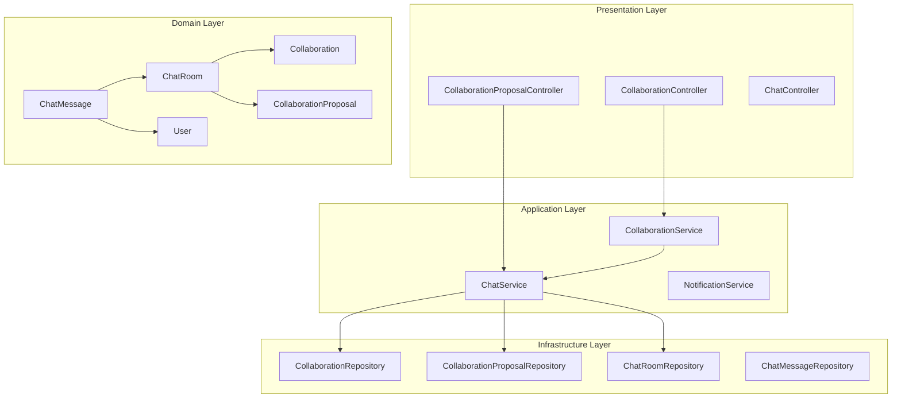
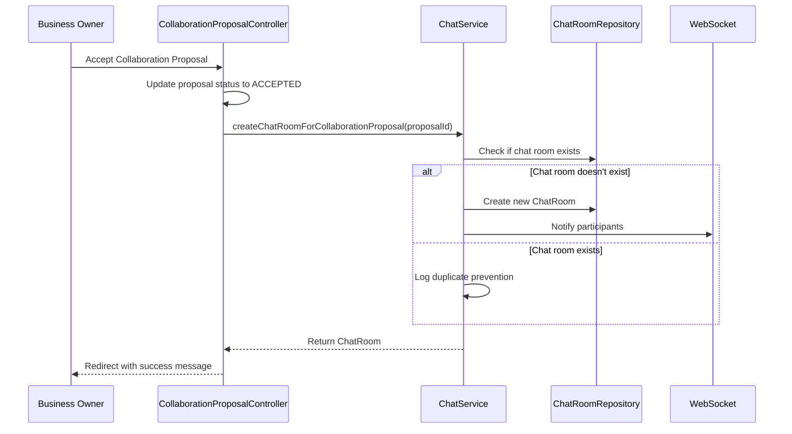
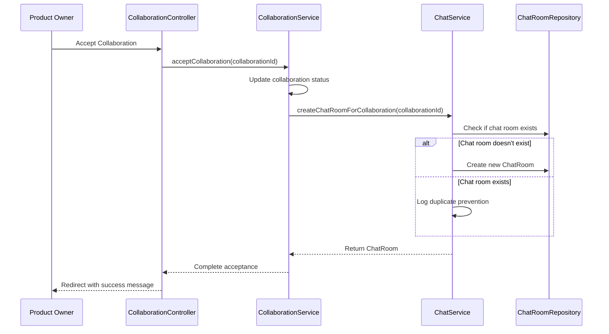

# 🤝💬 Collaboration-Chat Integration Architecture

## Overview

This document outlines the architectural integration between the Collaboration system and Chat system in the Topping platform, detailing how automatic chat room creation enhances business collaboration workflows.

## Integration Architecture

### High-Level Architecture



### Integration Flow

#### 1. Collaboration Proposal Acceptance


#### 2. Legacy Collaboration Acceptance


## Entity Relationship Design

### ChatRoom Dual Association
```java
@Entity
@Table(name = "chat_rooms")
public class ChatRoom {
    @Id @UuidGenerator
    private UUID uuid;
    
    // Support for business proposals
    @OneToOne
    @JoinColumn(name = "collaboration_proposal_uuid")
    private CollaborationProposal collaborationProposal;
    
    // Support for product collaborations  
    @OneToOne
    @JoinColumn(name = "collaboration_uuid")
    private Collaboration collaboration;
    
    // Business logic for participant identification
    public User getFirstParticipant() {
        if (collaborationProposal != null) {
            return collaborationProposal.getProposer();
        } else if (collaboration != null) {
            return collaboration.getApplicant();
        }
        return null;
    }
    
    public User getSecondParticipant() {
        if (collaborationProposal != null) {
            return collaborationProposal.getTargetBusinessOwner();
        } else if (collaboration != null) {
            return collaboration.getProduct().getCreator();
        }
        return null;
    }
}
```

### Database Schema Integration

#### Relationship Constraints
```sql
-- Ensure ChatRoom references exactly one collaboration type
ALTER TABLE chat_rooms ADD CONSTRAINT check_single_collaboration_reference
CHECK (
    (collaboration_proposal_uuid IS NOT NULL AND collaboration_uuid IS NULL) OR
    (collaboration_proposal_uuid IS NULL AND collaboration_uuid IS NOT NULL)
);

-- Foreign key constraints
ALTER TABLE chat_rooms ADD CONSTRAINT fk_chat_room_collaboration_proposal
FOREIGN KEY (collaboration_proposal_uuid) REFERENCES collaboration_proposals(uuid);

ALTER TABLE chat_rooms ADD CONSTRAINT fk_chat_room_collaboration  
FOREIGN KEY (collaboration_uuid) REFERENCES collaborations(uuid);
```

## Service Layer Integration

### ChatService Design Patterns

#### Duplicate Prevention Strategy
```java
public ChatRoom createChatRoomForCollaborationProposal(UUID proposalId) {
    Optional<CollaborationProposal> proposalOpt = collaborationProposalRepository.findById(proposalId);
    if (proposalOpt.isEmpty()) {
        throw new RuntimeException("CollaborationProposal not found with id: " + proposalId);
    }

    CollaborationProposal proposal = proposalOpt.get();
    
    // Check for existing chat room
    Optional<ChatRoom> existingRoom = chatRoomRepository.findByCollaborationProposal(proposal);
    if (existingRoom.isPresent()) {
        log.info("Chat room already exists for proposal: {}", proposalId);
        return existingRoom.get();
    }

    // Create new chat room
    ChatRoom chatRoom = ChatRoom.builder()
            .collaborationProposal(proposal)
            .roomName(generateRoomName(proposal))
            .isActive(true)
            .build();

    return chatRoomRepository.save(chatRoom);
}
```

#### Error Handling Strategy
```java
@Service
public class CollaborationService {
    
    public void acceptCollaboration(UUID collaborationId) {
        // Update collaboration status first
        collaboration.setStatus(CollaborationStatus.ACCEPTED);
        collaborationRepository.save(collaboration);

        // Attempt chat room creation with error isolation
        try {
            ChatRoom chatRoom = chatService.createChatRoomForCollaboration(collaborationId);
            log.info("Created chat room {} for accepted collaboration: {}", 
                    chatRoom.getUuid(), collaborationId);
        } catch (Exception e) {
            log.error("Failed to create chat room for collaboration: {}", collaborationId, e);
            // Chat creation failure doesn't block collaboration acceptance
        }
    }
}
```

## Repository Architecture

### Query Optimization for Participant Lookup

#### Challenge
Complex JPQL queries with nested relationships caused JPA validation failures:
```java
// This complex query failed JPA validation
@Query("SELECT cr FROM ChatRoom cr WHERE " +
       "(cr.collaborationProposal IS NOT NULL AND (cr.collaborationProposal.proposer = :user OR cr.collaborationProposal.targetBusinessOwner = :user)) OR " +
       "(cr.collaboration IS NOT NULL AND (cr.collaboration.applicant = :user OR cr.collaboration.product.createdBy = :user))")
List<ChatRoom> findByParticipant(@Param("user") User user);
```

#### Solution: Split Query Strategy
```java
// Separate queries for each collaboration type
@Query("SELECT cr FROM ChatRoom cr WHERE " +
       "cr.collaborationProposal IS NOT NULL AND " +
       "(cr.collaborationProposal.proposer = :user OR cr.collaborationProposal.targetBusinessOwner = :user)")
List<ChatRoom> findByCollaborationProposalParticipant(@Param("user") User user);

@Query("SELECT cr FROM ChatRoom cr JOIN cr.collaboration c JOIN c.product p WHERE " +
       "cr.collaboration IS NOT NULL AND " +
       "(c.applicant = :user OR p.creator = :user)")
List<ChatRoom> findByCollaborationParticipant(@Param("user") User user);

// Combine results in repository implementation
@Override
public List<ChatRoom> findByParticipant(User user) {
    List<ChatRoom> result = new ArrayList<>();
    result.addAll(jpaRepository.findByCollaborationProposalParticipant(user));
    result.addAll(jpaRepository.findByCollaborationParticipant(user));
    return result;
}
```

## UI Integration

### Chat Room List Integration
```html
<div th:each="chatRoom : ${chatRooms}" class="chat-room-item" th:data-room-id="${chatRoom.uuid}">
    <div class="room-avatar">
        <span th:text="${chatRoom.getFirstParticipant() != null ? 
                       chatRoom.getFirstParticipant().username.substring(0,1) : 'C'}">C</span>
    </div>
    <div class="room-info">
        <div class="room-name" th:text="${chatRoom.getCollaborationTitle()}">채팅방 이름</div>
        <div class="room-preview">메시지 내용</div>
    </div>
    <div class="room-meta">
        <div class="room-time">오후 12:31</div>
        <div class="unread-badge" th:if="false">1</div>
    </div>
</div>
```

### Dynamic Participant Information
- **Room Naming**: Automatic generation based on participant usernames
- **Avatar Generation**: User initials with gradient backgrounds
- **Status Indicators**: Collaboration status integration for context
- **Responsive Design**: Mobile-friendly chat interface

## WebSocket Integration

### Real-time Notification Flow
```javascript
// Automatic chat room creation triggers WebSocket notification
chatService.createChatRoomForCollaborationProposal(proposalId)
    .then(chatRoom => {
        // Notify participants via WebSocket
        messagingTemplate.convertAndSend(
            `/topic/user/${participant.uuid}/chat-rooms`, 
            chatRoom
        );
    });
```

### Client-side Room Updates
```javascript
class ChatInterface {
    constructor() {
        // Subscribe to new chat room notifications
        this.stompClient.subscribe(`/topic/user/${userId}/chat-rooms`, (message) => {
            const newChatRoom = JSON.parse(message.body);
            this.addChatRoomToList(newChatRoom);
        });
    }
}
```

## Security Integration

### Access Control
```java
@PreAuthorize("@chatSecurityService.canAccessChatRoom(authentication.name, #roomId)")
@GetMapping("/chat/room/{roomId}")
public String chatRoom(@PathVariable UUID roomId, Model model) {
    // Only collaboration participants can access chat rooms
}

@Component
public class ChatSecurityService {
    public boolean canAccessChatRoom(String username, UUID roomId) {
        User user = userRepository.findByEmail(username).orElse(null);
        if (user == null) return false;
        
        Optional<ChatRoom> chatRoom = chatRoomRepository.findById(roomId);
        return chatRoom.map(room -> room.hasParticipant(user)).orElse(false);
    }
}
```

## Monitoring & Observability

### Integration Metrics
```java
@Component
public class ChatIntegrationMetrics {
    
    @EventListener
    public void handleCollaborationAccepted(CollaborationAcceptedEvent event) {
        // Track automatic chat room creation
        meterRegistry.counter("chat.room.auto_created", 
                             "collaboration_type", event.getCollaborationType())
                    .increment();
    }
    
    @EventListener
    public void handleChatRoomCreated(ChatRoomCreatedEvent event) {
        // Track chat room creation success
        meterRegistry.timer("chat.room.creation_time")
                    .record(event.getCreationDuration());
    }
}
```

### Logging Strategy
```java
@Aspect
@Component
public class CollaborationChatIntegrationAspect {
    
    @AfterReturning(pointcut = "execution(* CollaborationService.acceptCollaboration(..))", 
                    returning = "result")
    public void logCollaborationAcceptance(JoinPoint joinPoint, Object result) {
        UUID collaborationId = (UUID) joinPoint.getArgs()[0];
        log.info("Collaboration {} accepted, triggering chat room creation", collaborationId);
    }
}
```

## Performance Considerations

### Database Performance
- **Split Queries**: Avoid complex JPQL that causes performance issues
- **Proper Indexing**: Index on collaboration relationship columns
- **Transaction Boundaries**: Minimize transaction scope for chat operations
- **Connection Pooling**: Efficient database connection management

### Caching Strategy
```java
@Cacheable(value = "chatRooms", key = "#user.uuid")
public List<ChatRoom> findByParticipant(User user) {
    // Cache user's chat rooms to reduce database queries
}

@CacheEvict(value = "chatRooms", key = "#user.uuid")
public ChatRoom createChatRoom(User user, ...) {
    // Invalidate cache when new chat room is created
}
```

## Deployment Considerations

### Database Migration
```sql
-- Add new columns for dual collaboration support
ALTER TABLE chat_rooms ADD COLUMN collaboration_uuid UUID;
ALTER TABLE chat_rooms ADD CONSTRAINT fk_chat_room_collaboration 
    FOREIGN KEY (collaboration_uuid) REFERENCES collaborations(uuid);

-- Update existing chat rooms if needed
UPDATE chat_rooms SET collaboration_uuid = (
    SELECT uuid FROM collaborations WHERE chat_rooms.legacy_collaboration_id = collaborations.id
) WHERE collaboration_proposal_uuid IS NULL;
```

### Configuration Management
```yaml
# Application configuration for chat integration
topping:
  chat:
    auto-create-rooms: true
    duplicate-prevention: true
    error-isolation: true
  collaboration:
    chat-integration: enabled
```

## Future Enhancements

### Enhanced Integration Features
1. **Status Synchronization**: Real-time collaboration status updates in chat
2. **Rich Messaging**: Embedded collaboration details in chat messages
3. **File Sharing**: Document sharing for collaboration discussions
4. **Meeting Integration**: Schedule meetings directly from chat rooms

### Scalability Improvements
1. **Event-Driven Architecture**: Decouple chat creation with domain events
2. **Microservice Split**: Separate chat service for independent scaling
3. **Message Queuing**: Asynchronous chat room creation for high volume
4. **Distributed Caching**: Redis cluster for chat room caching

## Related Documentation
- [Chat Domain Documentation](../domains/chat/README.md) - Complete chat system overview
- [Collaboration Domain Documentation](../domains/collaboration/README.md) - Collaboration system details
- [Chat System Integration](./chat-system-integration.md) - Technical implementation details
- [WebSocket Configuration](./websocket-config.md) - Real-time communication setup
- [Database Performance](./database-performance.md) - Database optimization strategies